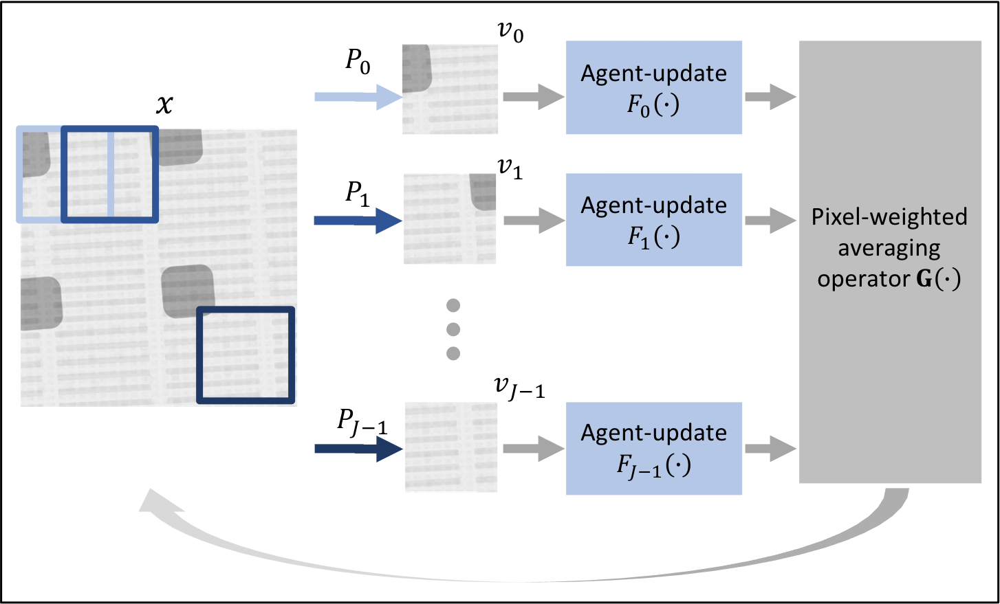
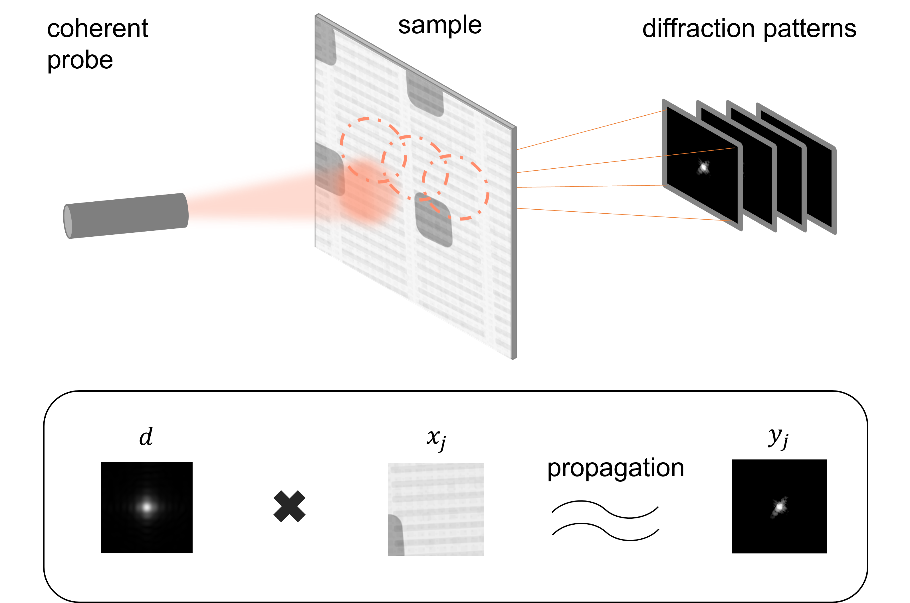

========
Overview
========

PMACE: Projected Multi-Agent Consensus Equilibrium
--------------------------------------------------

A reconstruction :math:`x` is subdivided into possibly overlapping components, :math:`v_j`, and distributed to multiple agents, :math:`F_j`, each of which acts to improve this local reconstruction. These local reconstructions are combined using a pixel-weighted averaging operator, :math:`G`, that reassembles the local components into a consistent global reconstruction.

   PMACE pipeline

Distributed Reconstruction and Application
------------------------------------------

**Ptychography** is an advanced computational imaging technique that can produce high-resolution images of nanoscale objects such as semiconductors and other manufactured nanomaterials. It works by moving a coherent X-ray probe across the object in overlapping patches and the far-field diffraction pattern associated with each scan position will be collected and used to recover the structure of the sample.

   Ptychographic Imaging
